# Praktikum Git - 556158

Website sederhana untuk tugas praktikum Git & GitHub.

## Deskripsi Project

Project ini dibuat untuk memenuhi tugas praktikum mata kuliah
Praktikum Pemrograman Web 1. Website berisi halaman utama dengan navbar,
konten, dan footer.

## Cara Menjalankan

1. Clone repository:
   git clone https://github.com/celliaanastavio/praktikum-git-556158.git
2. Buka file index.html di browser

## Screenshot Website

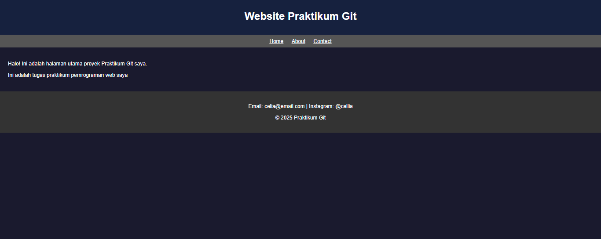

## Git Log


## Branch Protection


## Dokumentasi Perintah Git

| Perintah                                        | Penjelasan                                        |
| ----------------------------------------------- | ------------------------------------------------- |
| `git clone <url>`                               | Menyalin repository dari GitHub ke komputer lokal |
| `git add .`                                     | Menambahkan semua perubahan ke staging area       |
| `git commit -m "pesan"`                         | Menyimpan perubahan dengan pesan deskriptif       |
| `git push origin main`                          | Mengunggah commit lokal ke GitHub                 |
| `git push origin nama-branch`                   | Mengunggah branch baru ke GitHub                  |
| `git pull origin main`                          | Mengunduh perubahan terbaru dari GitHub           |
| `git checkout -b nama`                          | Membuat branch baru sekaligus pindah ke sana      |
| `git checkout main`                             | Berpindah ke branch main                          |
| `git merge nama-branch`                         | Menggabungkan branch lain ke branch aktif         |
| `git log --oneline --graph`                     | Melihat riwayat commit dalam bentuk grafik        |
| `git rebase -i HEAD~3`                          | Interactive rebase untuk squash beberapa commit   |
| `git rebase --abort`                            | Membatalkan proses rebase yang sedang berjalan    |
| `git config --global core.editor "code --wait"` | Mengatur VS Code sebagai editor default Git       |

## Dokumentasi Tugas Praktikum

## TUGAS 1 — Inisialisasi & Commit History

### 1. Membuat Repository

Repository baru dibuat di GitHub dengan nama praktikum-git-556158 dengan visibilitas Public. Proses pembuatan dilakukan melalui halaman utama GitHub dengan memilih menu New Repository, kemudian mengisikan nama repository dan memilih visibilitas public. Setelah itu create new repository berhasil dibuat dan siap digunakan.


### 2. Clone & Commit

Repository di-clone ke lokal menggunakan perintah:

```
git clone https://github.com/celliaanastavio/praktikum-git-556158.git
```

Perintah ini berfungsi untuk menyalin isi repository dari GitHub ke komputer lokal, sehingga dapat dilakukan pengeditan langsung melalui VS Code.
Kemudian dibuat file `index.html` berisi halaman web sederhana dengan struktur header, navbar, konten utama, dan footer. Setiap perubahan dicatat menggunakan:

```
git add .
git commit -m "pesan commit"
```

git add digunakan untuk menambahkan seluruh file yang telah diubah ke dalam staging area, sedangkan git commit -m "pesan" digunakan untuk menyimpan perubahan beserta pesan yang menjelaskan apa yang diubah.
Setelah semua commit selesai, perubahan diunggah ke GitHub:

```
git push origin main
```

Total commit yang dilakukan: **7 commit** dengan konvensi Conventional Commits.

| No  | Pesan Commit                                            | Tipe  |
| --- | ------------------------------------------------------- | ----- |
| 1   | feat: add initial HTML structure with header and footer | feat  |
| 2   | chore: add gitignore                                    | chore |
| 3   | style: change header background color to blue           | style |
| 4   | feat: add description paragraph in main section         | feat  |
| 5   | fix: update page title to include NIM                   | fix   |
| 6   | docs: add README with project description               | docs  |
| 7   | docs: add git log screenshot to README                  | docs  |

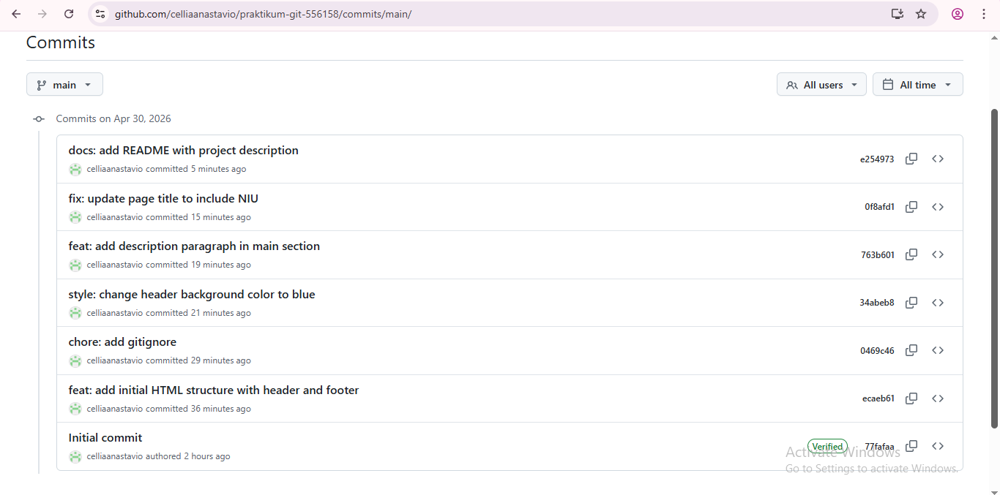

### 3. File .gitignore

File `.gitignore` dibuat untuk mengecualikan file yang tidak perlu di-track oleh Git:

```
.DS_Store
*.log
node_modules/
```

File ini di-commit dengan pesan `chore: add gitignore`.

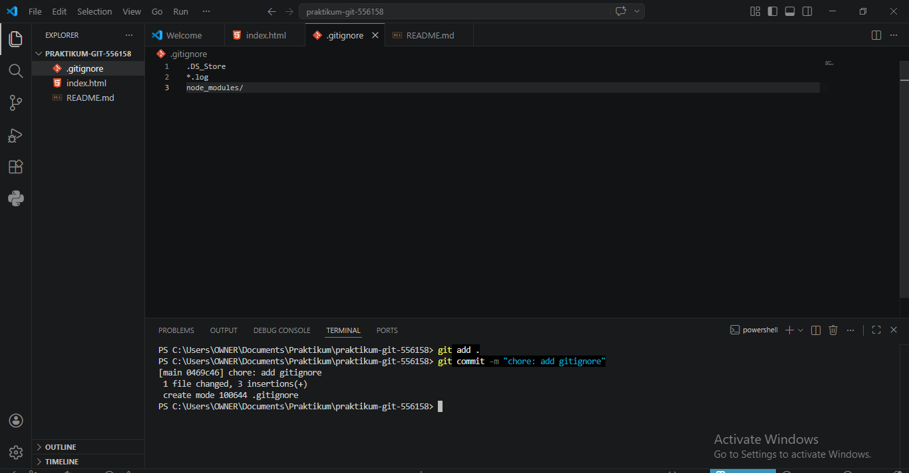

### 4. Git Log

Perintah `git log --oneline --graph` digunakan untuk melihat riwayat commit dalam bentuk ringkas:

```
git log --oneline --graph
```

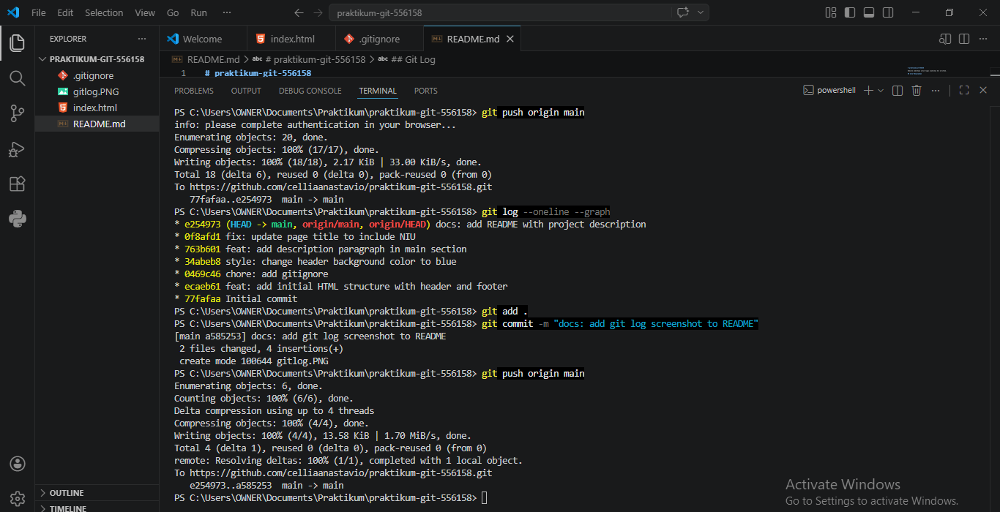

Hasil screenshot git log kemudian ditambahkan ke README.md menggunakan sintaks Markdown `` dan di-push ke GitHub.

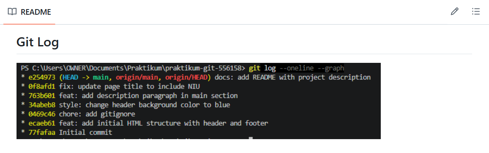

---

## TUGAS 2 — Branching & Pull Request

### 1. Membuat 3 Branch

**Branch 1 — feature/navbar**

```
git checkout -b feature/navbar
git add .
git commit -m "feat: add navigation bar"
git push origin feature/navbar
```

Perubahan: Menambahkan navbar dengan link Home, About, Contact.


**Branch 2 — feature/footer**

```
git checkout main
git checkout -b feature/footer
git add .
git commit -m "feat: enhance footer with contact info"
git push origin feature/footer
```

Perubahan: Menambahkan informasi kontak (email & Instagram) dan copyright di footer.


**Branch 3 — hotfix/typo**

```
git checkout main
git checkout -b hotfix/typo
git add .
git commit -m "fix: correct typo in main paragraph"
git push origin hotfix/typo
```

Perubahan: Memperbaiki typo pada paragraf utama halaman.

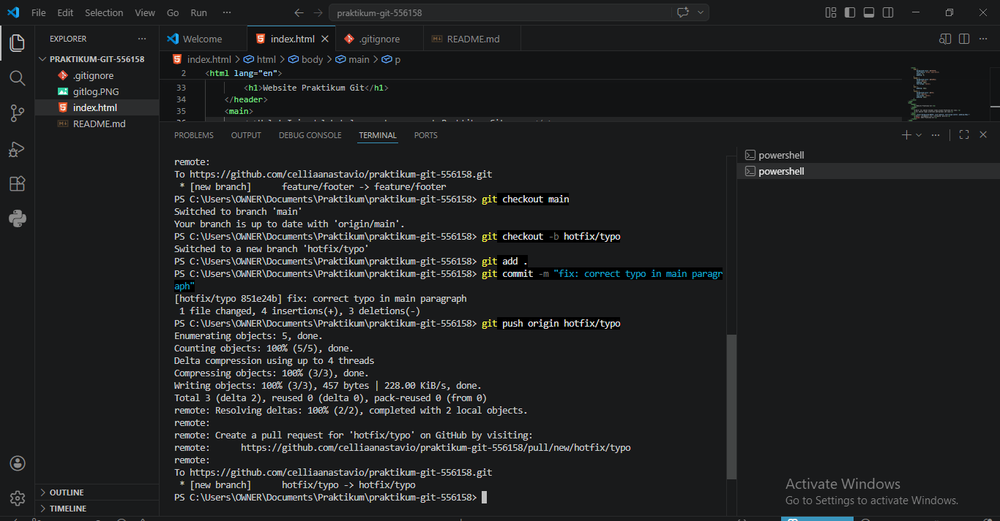

### 2. Pull Request

Dibuat 3 Pull Request terpisah di GitHub dengan detail:

| PR  | Judul                                  | Label       | Branch         |
| --- | -------------------------------------- | ----------- | -------------- |
| #1  | feat: Add navigation bar               | enhancement | feature/navbar |
| #2  | feat: Enhance footer with contact info | enhancement | feature/footer |
| #3  | fix: Correct typo in main paragraph    | bug         | hotfix/typo    |


### 3. Merge Strategy

- PR **feature/navbar** dan **feature/footer** → **Squash and merge**
- PR **hotfix/typo** → **Create a merge commit**
- Setiap branch dihapus setelah merge menggunakan tombol **Delete branch**


### 4. Branch Protection Rule

Branch Protection Rule dipasang pada branch `main` melalui:
Settings → Branches → Add classic branch protection rule

Pengaturan yang diaktifkan:

- ✅ Require a pull request before merging


---

## TUGAS 3 — Konflik & Rebase

### 1. Simulasi Konflik

**Branch experiment/color-A**

```
git checkout -b experiment/color-A
git add .
git commit -m "style: change body background to red"
git push origin experiment/color-A
```

Perubahan: background-color body diubah menjadi #ff6b6b (merah).

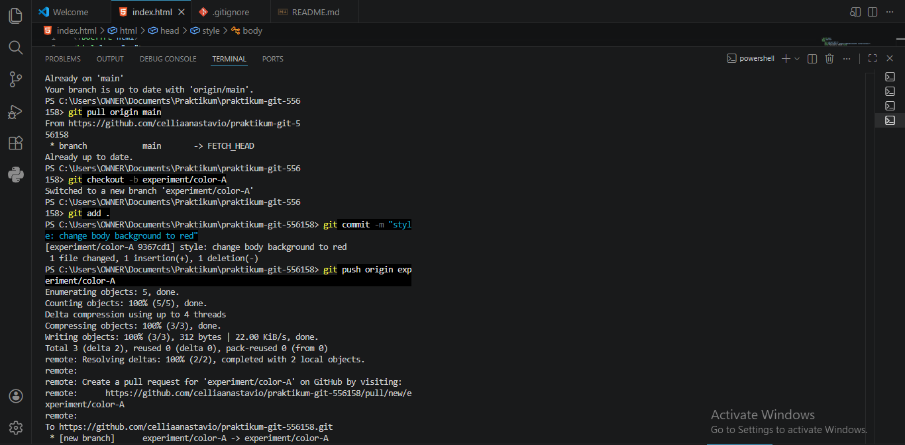

**Branch experiment/color-B**

```
git checkout main
git checkout -b experiment/color-B
git add .
git commit -m "style: change body background to green"
git push origin experiment/color-B
```

Perubahan: background-color body diubah menjadi #6bffb8 (hijau) pada baris CSS yang sama.

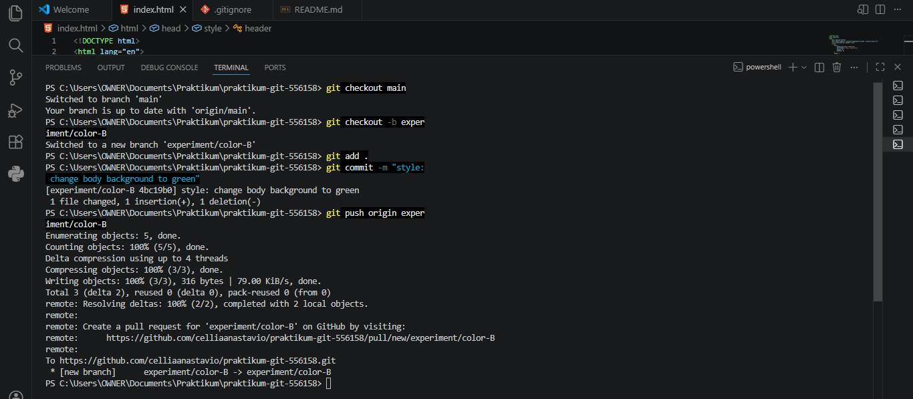

### 2. Menyelesaikan Konflik

Merge experiment/color-A ke main terlebih dahulu (tidak konflik):

```
git checkout main
git merge experiment/color-A
git push origin main
```

Kemudian merge experiment/color-B (terjadi konflik!):

```
git merge experiment/color-B
```

Konflik terjadi karena kedua branch mengubah baris CSS yang sama yaitu `background-color` pada body. Git menampilkan tanda konflik seperti berikut:

```
<<<<<<< HEAD
    background-color: #ff6b6b;
=======
    background-color: #6bffb8;
>>>>>>> experiment/color-B
```

Konflik diselesaikan secara manual di VS Code dengan memilih salah satu perubahan yang ingin dipertahankan menggunakan fitur **Accept Current Change**.

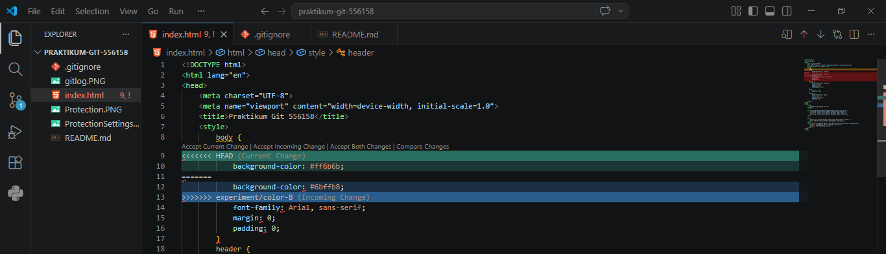

Setelah konflik diselesaikan, dilakukan commit dan push:

```
git add .
git commit -m "fix: resolve merge conflict in body background color"
git push origin main
```

### 3. Interactive Rebase

**Membuat branch feature/dark-mode dengan 3 commit**

```
git checkout -b feature/dark-mode
```

Commit 1 — ubah background body menjadi gelap:

```
git add .
git commit -m "wip: set dark background color"
```

Commit 2 — tambahkan warna teks putih:

```
git add .
git commit -m "wip: set white text color for dark mode"
```

Commit 3 — ubah warna header:

```
git add .
git commit -m "wip: update header color for dark mode"
```

**Squash 3 commit menjadi 1 menggunakan interactive rebase**

Sebelum rebase, VS Code diatur sebagai editor default Git:

```
git config --global core.editor "code --wait"
```

Kemudian jalankan interactive rebase:

```
git rebase -i HEAD~3
```

Pada editor yang muncul, ubah `pick` menjadi `squash` untuk commit ke-2 dan ke-3:

```
pick   abc1111 wip: set dark background color
squash abc2222 wip: set white text color for dark mode
squash abc3333 wip: update header color for dark mode
```

Simpan dan tutup editor. Kemudian ganti pesan commit menjadi:

```
feat: implement dark mode with dark background and white text
```

Simpan dan tutup editor kembali.


**Push branch feature/dark-mode ke GitHub**

```
git push origin feature/dark-mode
```

Pull Request dibuat melalui GitHub dengan judul `feat: Implement dark mode` kemudian di-merge menggunakan **Squash and merge** dan branch dihapus setelah merge.

---

## TUGAS 4 — Dokumentasi & Invite

### 1. README.md

README.md dilengkapi dengan deskripsi project, cara menjalankan, screenshot website, git log, branch protection, dan dokumentasi perintah Git menggunakan perintah:

```
git add .
git commit -m "docs: complete README with full documentation"
git push origin main
```


### 2. Issues

Dibuat 3 Issues di GitHub melalui tab **Issues → New issue**:

| Issue | Judul                                    | Status    |
| ----- | ---------------------------------------- | --------- |
| #4    | feat: tambahkan halaman About            | ✅ Closed |
| #5    | feat: tambahkan form kontak              | ✅ Closed |
| #6    | bug: tampilan kurang responsif di mobile | ✅ Closed |

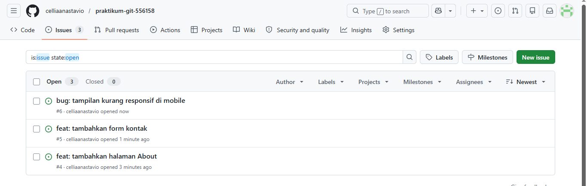

Setiap issue diselesaikan dengan membuat branch baru, melakukan perubahan, lalu commit dan push ke GitHub:

**Issue #4 — Halaman About**

```
git checkout main
git pull origin main
git checkout -b feat/about-page
git add .
git commit -m "feat: add about page - Closes #4"
git push origin feat/about-page
```

**Issue #5 — Form Kontak**

```
git checkout main
git pull origin main
git checkout -b feat/contact-form
git add .
git commit -m "feat: add contact form - Closes #5"
git push origin feat/contact-form
```

**Issue #6 — Responsif Mobile**

```
git checkout main
git pull origin main
git checkout -b fix/responsive
git add .
git commit -m "fix: add responsive CSS - Closes #6"
git push origin fix/responsive
```

Setiap branch kemudian dibuat Pull Request di GitHub dengan menyertakan `Closes #nomor` pada deskripsi PR, sehingga issue otomatis tertutup saat PR di-merge menggunakan **Squash and merge**.

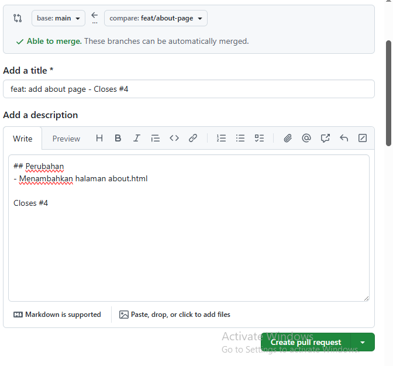


### 3. Collaborator

Dosen dan asisten di-invite sebagai collaborator melalui:
**Settings → Collaborators → Add people**

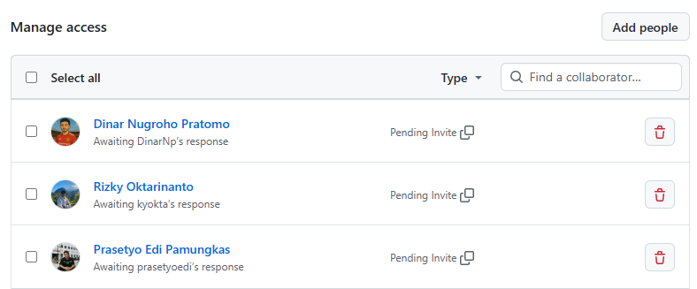

### 4. Release v1.0.0

Release v1.0.0 dibuat melalui **Releases → Create a new release** dengan langkah:

1. Klik **Choose a tag** → ketik `v1.0.0` → **Create new tag**
2. Isi **Release title**: `v1.0.0 - Initial Release`
3. Isi changelog pada Release notes
4. Klik **Publish release**

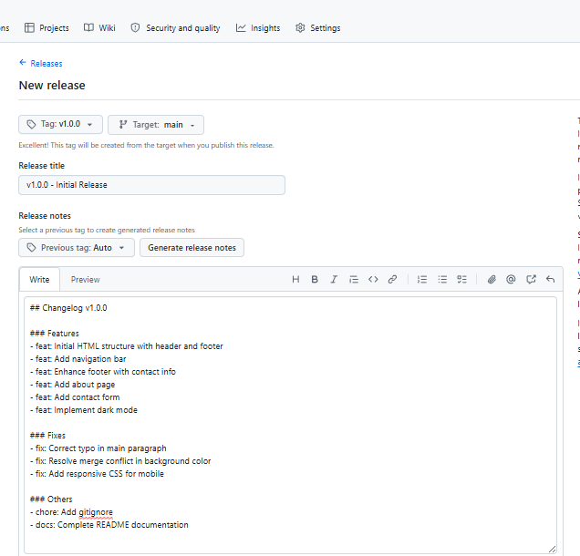
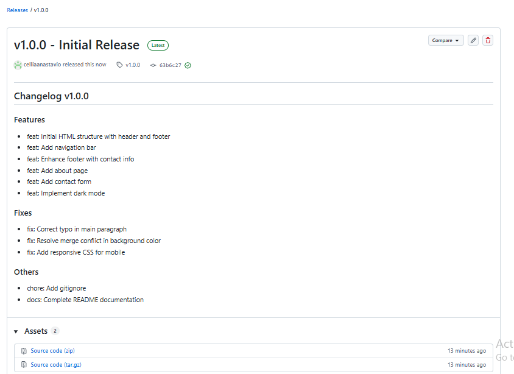

---
